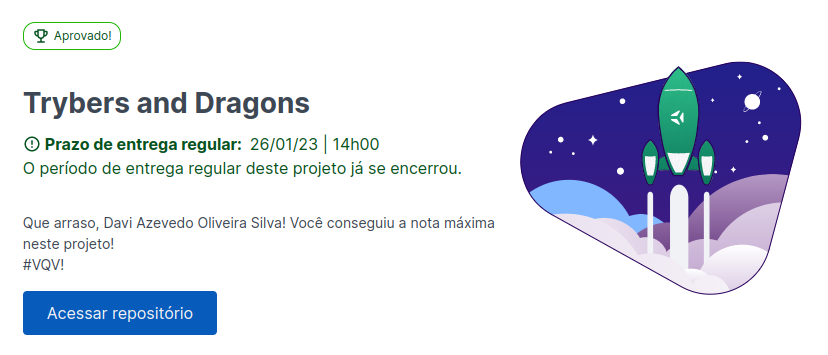

# Trybers and Dragons 🐉

### Sobre

Trybers and Dragons foi um projeto desenvolvido durante o módulo de back-end do curso da Trybe. O objetivo era colocar em prática os princípios da arquitetura `SOLID` e os princípios de `POO` em uma estrutura de jogos de interpretação de papéis, mais conhecidos como jogos RPG (Role Playing Game).

Os códigos que eu fiz podem ser encontrados na pasta `src`

### Tecnologias

- Typescript
- Express

### Como rodar o projeto

  
<strong>🐋 Rodando no Docker vs Localmente</strong>
 
  
  ## Com Docker

> Clone o repositório com o comando `git clone git@github.com:daviazev/trybers-and-dragons.git`.

> Rode o serviço `node` com o comando `docker-compose up -d`.

- Esse serviço irá inicializar um container chamado `trybers_and_dragons`.
- A partir daqui você pode rodar o container `trybers_and_dragons` via CLI ou abri-lo no VS Code.

> Use o comando `docker exec -it trybers_and_dragons bash`.

- Ele te dará acesso ao terminal interativo do container criado pelo compose, que está rodando em segundo plano.

> Instale as dependências [**Caso existam**] com `npm install`

⚠ Atenção ⚠ Caso opte por utilizar o Docker, **TODOS** os comandos disponíveis no `package.json` (npm start, npm test, npm run dev, ...) devem ser executados **DENTRO** do container, ou seja, no terminal que aparece após a execução do comando `docker exec` citado acima.

⚠ Atenção ⚠ O **git** dentro do container não vem configurado com suas credenciais. Ou faça os commits fora do container, ou configure as suas credenciais do git dentro do container.

⚠ Atenção ⚠ Não rode o comando npm audit fix! Ele atualiza várias dependências do projeto, e essa atualização gera conflitos com o avaliador.

## Sem Docker

> Instale as dependências [**Caso existam**] com `npm install`

⚠ Atenção ⚠ Não rode o comando npm audit fix! Ele atualiza várias dependências do projeto, e essa atualização gera conflitos com o avaliador.

✨ Para rodar o projeto desta forma, obrigatoriamente você deve ter o `node` instalado em seu computador.

✨ O avaliador espera que a versão do `node` utilizada seja a 16.

   

